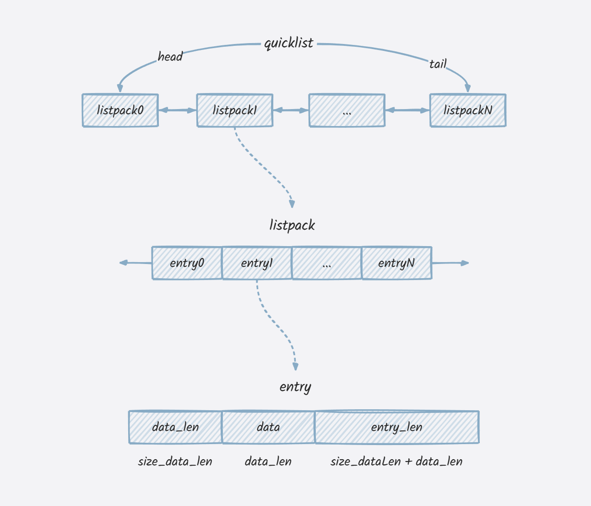

# quicklist

[](https://goreportcard.com/report/github.com/xgzlucario/quicklist) [](https://pkg.go.dev/github.com/xgzlucario/quicklist)   [](https://codecov.io/gh/xgzlucario/quicklist) [](https://github.com/xgzlucario/quicklist/actions/workflows/go.yml)

Implement redis quicklist data structure, based on listpack rather than ziplist to optimize cascade update.

`quicklist` has 25% faster, 70% less memory than `[]string`, and with less gc pause time.

```
[]string
entries: 20000000
alloc: 860 mb
gcsys: 10 mb
heap inuse: 860 mb
heap object: 19531 k
gc: 14
pause: 566.08µs
cost: 1.821569192s

quicklist
entries: 20000000
alloc: 258 mb
gcsys: 5 mb
heap inuse: 258 mb
heap object: 4274 k
gc: 14
pause: 508.364µs
cost: 1.447244873s
```

# Usage

```go
package main

import (
	"fmt"

	"github.com/xgzlucario/quicklist"
)

func genKey(i int) string {
	return fmt.Sprintf("%05d", i)
}

func main() {
	ls := quicklist.New()
	// RPush
	for i := 0; i < 100; i++ {
		ls.RPush(genKey(i))
	}
	// LPush
	for i := 0; i < 100; i++ {
		ls.RPush(genKey(i))
	}
	// Len
	fmt.Println("Len:", ls.Size()) // 200
	// Index
	val, ok := ls.Index(50)
	fmt.Println("Index:", val, ok)
	// Set
	ok = ls.Set(0, "newValue")
	fmt.Println("Set:", ok) // true
	// LPop
	val, ok = ls.LPop()
	fmt.Println("LPop:", val, ok) // newValue, true
	// RPop
	val, ok = ls.RPop()
	fmt.Println("RPop:", val, ok) // 00099, true
	// Range
	ls.Range(0, -1, func(s []byte) (stop bool) {
		return false
	})
	ls.RevRange(0, -1, func(s []byte) (stop bool) {
		return false
	})
	// Remove
	fmt.Println(ls.Remove(1)) // 00002, true
}
```

# Benchmark

```
goos: linux
goarch: amd64
pkg: github.com/xgzlucario/quicklist
cpu: 13th Gen Intel(R) Core(TM) i5-13600KF
BenchmarkList/lpush-20           9595122           133.4 ns/op          54 B/op          3 allocs/op
BenchmarkList/rpush-20          13871919           86.91 ns/op          30 B/op          2 allocs/op
BenchmarkList/lpop-20           30589072           38.24 ns/op          12 B/op          1 allocs/op
BenchmarkList/rpop-20           29978404           38.86 ns/op          11 B/op          1 allocs/op
BenchmarkList/index-20           2562333           465.2 ns/op           8 B/op          1 allocs/op
BenchmarkList/set-20             2256325           519.2 ns/op          16 B/op          1 allocs/op
BenchmarkList/range-20             27028           44605 ns/op           0 B/op          0 allocs/op
BenchmarkList/revrange-20          25390           46755 ns/op           0 B/op          0 allocs/op
BenchmarkList/marshal-20           21321           58976 ns/op      514795 B/op         18 allocs/op
PASS
```

# Internal

